# Hammock plot

## Table of Contents

- [Description](#description)
- [Gallery](#gallery)
- [Installation](#installation)
  - [Example: Asthma data](#example-asthma-data)
  - [Example Satisfaction scales for the diabetes data](#example-satisfaction-scales-for-the-diabetes-data)
  - [Example value_order for the Shakespeare data](#example-value_order-for-the-shakespeare-data)
  - [Example same_scale using Shakespeare data](#example-same_scale-using-shakespeare-data)
  - [Example display_type using penguin data](#example-display_type-using-penguin-data)
- [API Reference](#api-reference)
- [Historical context](#historical-context)
  - [References](#references)
  - [Other implementations of the hammock plot](#other-implementations-of-the-hammock-plot)
- [Authors](#authors)


## Description

The hammock visualizes categorical or mixed categorical and numerical data. The hammock plot uses parallel coordinates which means that the variable axes are parallel to one another. Categories within a variable are spread out along a vertical line. Categories of adjacent variables are connected by boxes (rectangles or parallelograms). The width of a box is proportional to the number of observations that the box represents (i.e. have the same values/categories for the two variables). The "width" of a box refers to the distance between the longer set of parallel lines rather than the vertical distance.

If boxes are very thin (e.g., they just represent one observation) they look like a line. In that case, if no labels or missing values are used, the hammock plot corresponds to a parallel coordinate plot.

## Gallery
Click any image to explore the whole gallery or use the direct link: [Gallery](https://tianchengy.github.io/hammock_plot/gallery).

<p>
  <a href="https://tianchengy.github.io/hammock_plot/gallery">
    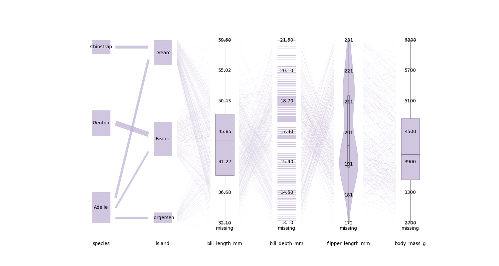
  </a>
  <a href="https://tianchengy.github.io/hammock_plot/gallery">
    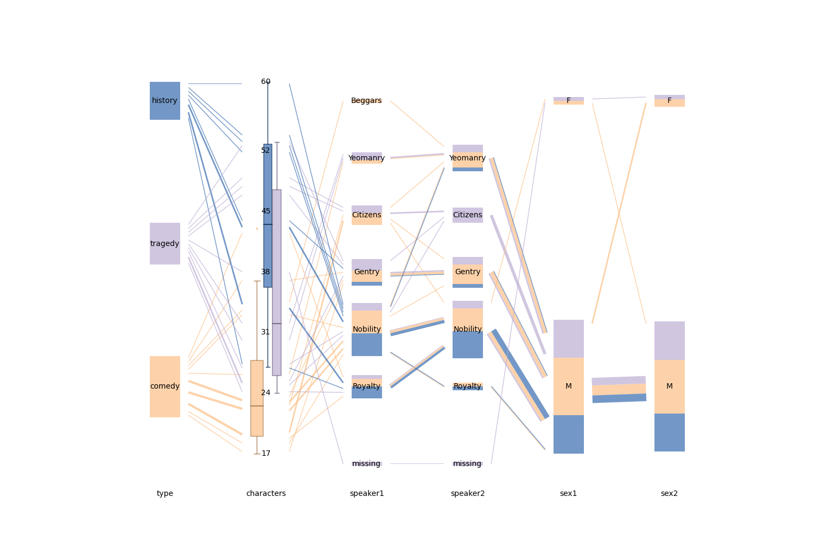
  </a>
  <a href="https://tianchengy.github.io/hammock_plot/gallery">
    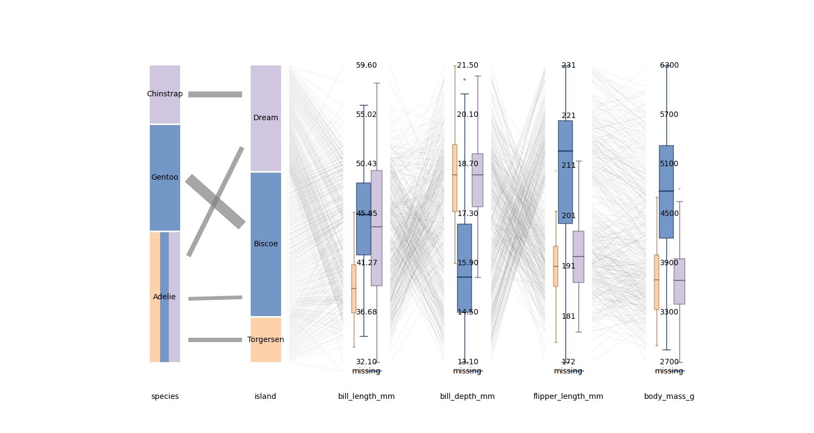
  </a>
  <a href="https://tianchengy.github.io/hammock_plot/gallery">
    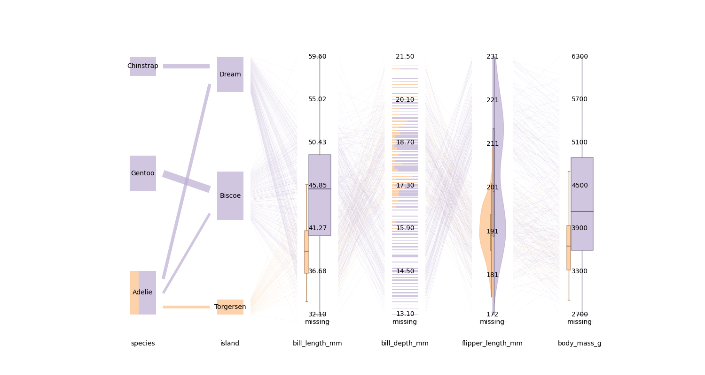
  </a>
</p>


## Installation
The hammock plot package is accessible for use from [this website](https://hammock-plot.streamlit.app/).

You can also install hammock from `pip`:

```shell
pip install hammock_plot
```


### Example: Asthma data

We import the asthma dataset (Schonlau 2024):

```python
import hammock_plot
import pandas as pd
df = pd.read_csv('./data/data_asthma.csv')
```

Minimal example of a hammock plot:
```python
var = ["hospitalizations","group","gender","comorbidities"]
hammock = hammock_plot.Hammock(data_df = df)
ax = hammock.plot(var=var)
```


The labels for the numerical variables aren't as desired; we would like the labels directly drawn on the data. For our numerical variables, we ignore the level management and instead label each value or level  that occurs in the variable.

```python
numeric_levels = {"comorbidities": None, "hospitalizations": None}
ax = hammock.plot(var=var, numerical_var_levels=numeric_levels)
```

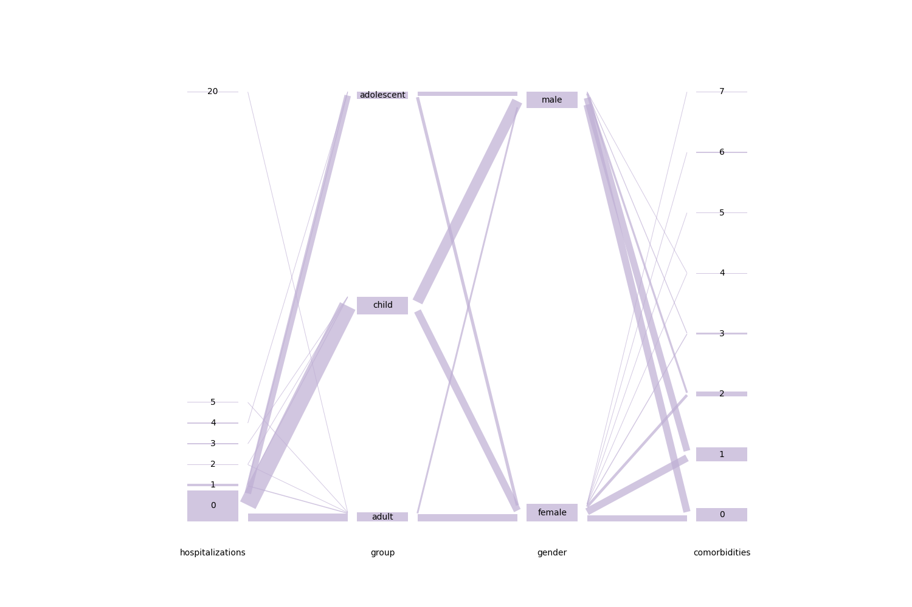

The ordering of the child-adolescent-adult variable is not in the desired order; adult should not be in the middle. We now specify a specific order, child-adolescent-adult.

```python
group_order = ["child", "adolescent", "adult"]
value_order = {"group": group_order}
hammock = hammock_plot.Hammock(data_df = df)
ax = hammock.plot(var=var, value_order=value_order, numerical_var_levels=numeric_levels)
```

<!--- to restrict image size, I am using a an html command, rather than the standard  --->
<!---    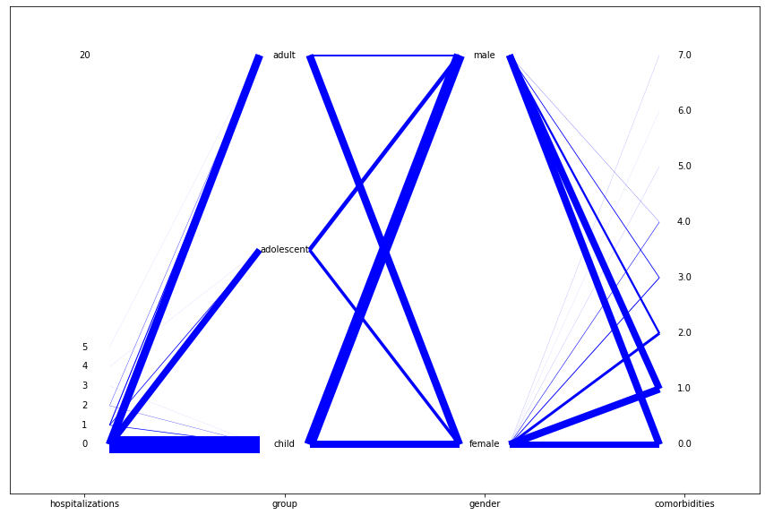   --->
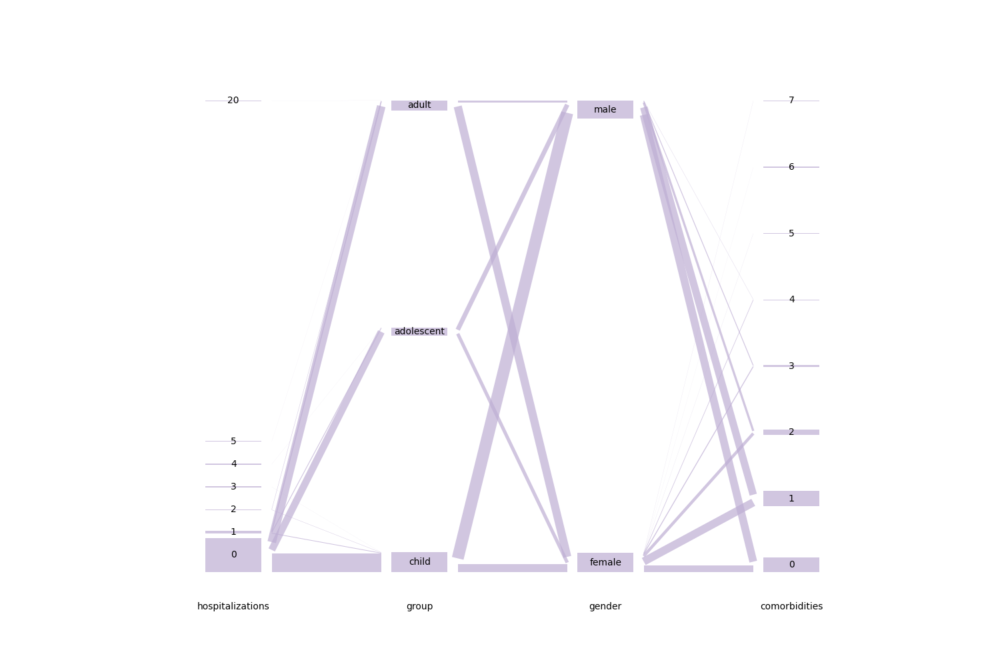

We highlight observations with comorbidities=0:

```python
ax = hammock.plot(var=var ,hi_var="comorbidities", hi_value=[0], colors=["orange"], numerical_var_levels=numeric_levels)
```

<!---   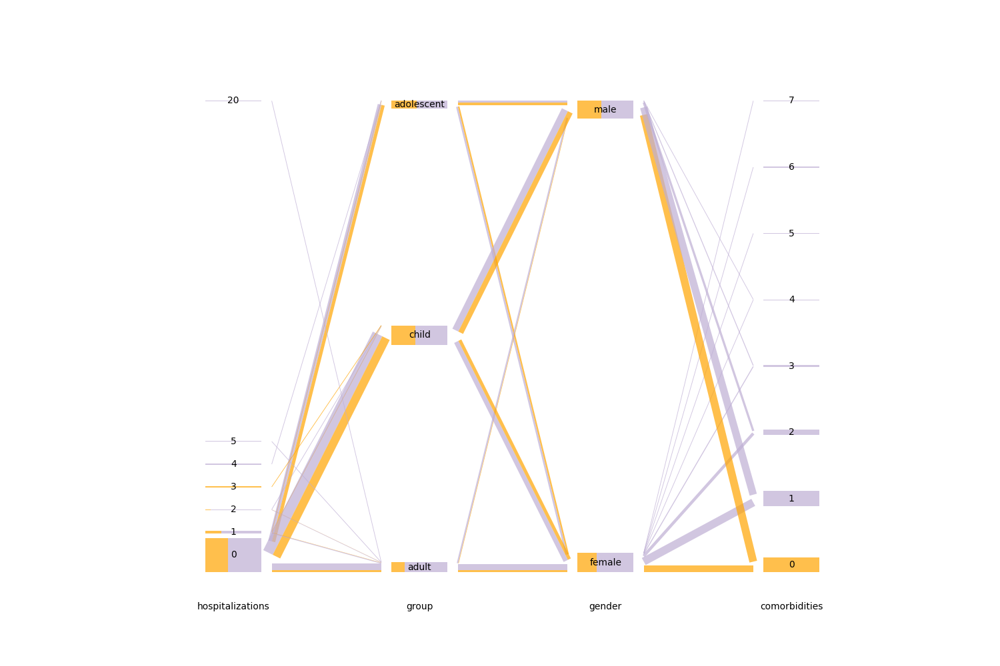    --->


### Example Satisfaction scales for the diabetes data

We import the diabetes dataset:

```python
import hammock_plot
import pandas as pd
df = pd.read_csv('./data/data_diabetes.csv')
```

The three variables represent different ordinal scales for satisfaction. We are checking for missing values:
```python
var = ["sataces","satcomm","satrate"]
hammock = hammock_plot.Hammock(data_df = df)
ax = hammock.plot(var=var, 
        missing=True, 
        numerical_var_levels={"sataces": None, "satcomm": None, "satrate": None}, 
        min_bar_height=0.2, 
        uni_vfill=0.3) 
```

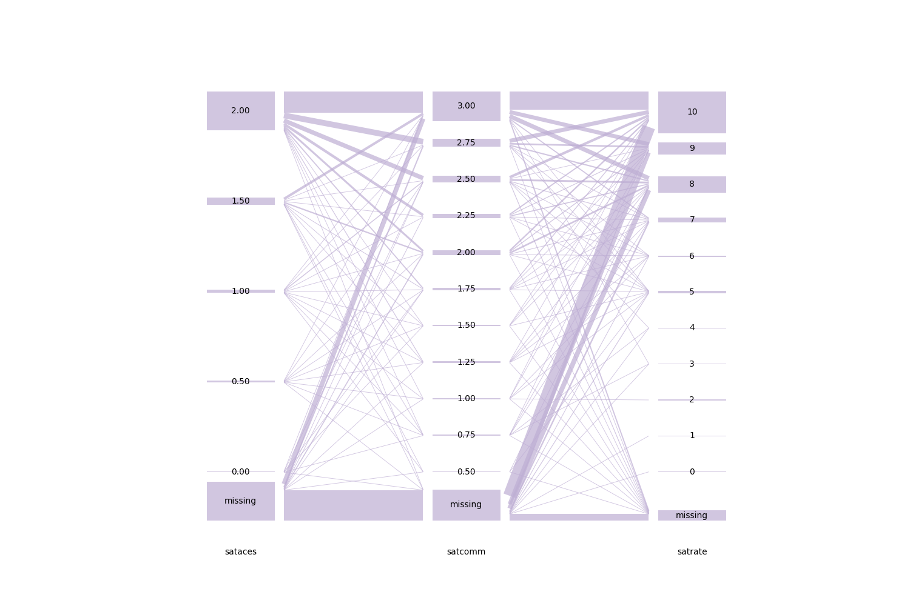

The missing value category is shown at the bottom for each variable. We find missing values for all 3 variables, but fewest for the last one. We also see a phenomenon called "top coding", where
satisfied respondents simply choose the highest value.

### Example value_order for the Shakespeare data

We import the Shakespeare dataset (Schonlau, 2024):

```python
import hammock_plot
import pandas as pd
df = pd.read_csv('./data/data_shakespeare_v5.csv')
```

We use a dictionary to map the values of the variables `speaker1` and `speaker2` according to the social class hierarchy. We also choose different colors.
```python
var_lst = ["type","speaker1","speaker2","sex1"]
color_lst = ["#fdc086",  "#386cb0", "#7fc97f"]
hi_value = ["Beggars","Citizens","Gentry"]

speaker_order=["Royalty", "Nobility", "Gentry", "Citizens", "Yeomanry", "Beggars"]

hammock = hammock_plot.Hammock(data_df = df)
ax = hammock.plot(var=var_lst,
    uni_vfill=0.6,
    connector_fraction=0.1,
    hi_var = "speaker1", hi_value=hi_value,colors=color_lst,
    missing=True,
    value_order ={"speaker1":speaker_order,"speaker2":speaker_order})
```

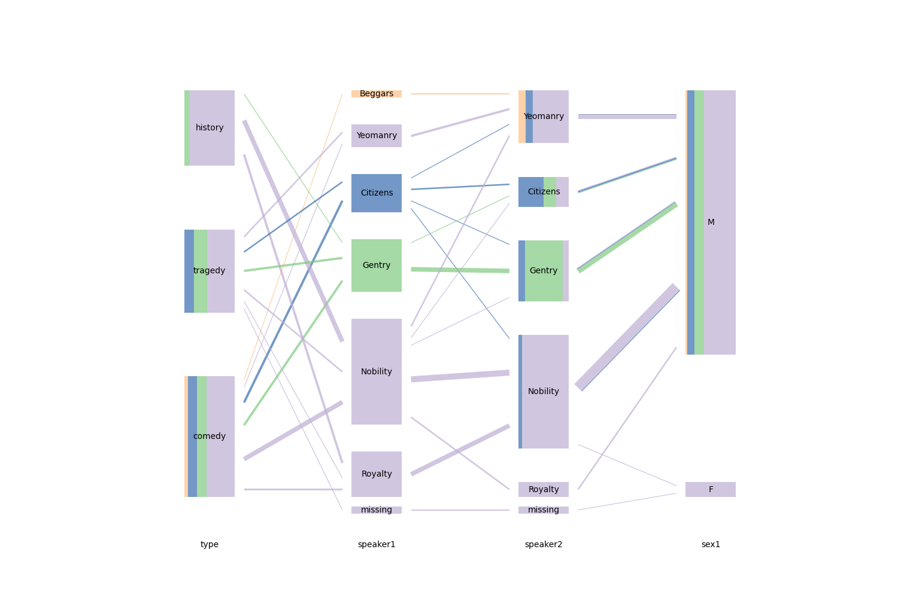

### Example same_scale using Shakespeare data
`speaker1` and `speaker2` should have the same layout, but only `speaker1` has the category Beggars. We can force the same layout using `same_scale`.
```python
hammock = hammock_plot.Hammock(data_df = df)
ax = hammock.plot(var=var_lst,hi_var = "speaker1", hi_value=hi_value,colors=color_lst, bar_width=0.6,missing=True,
                value_order ={"speaker1":speaker_order}, same_scale=["speaker1", "speaker2"] )
```
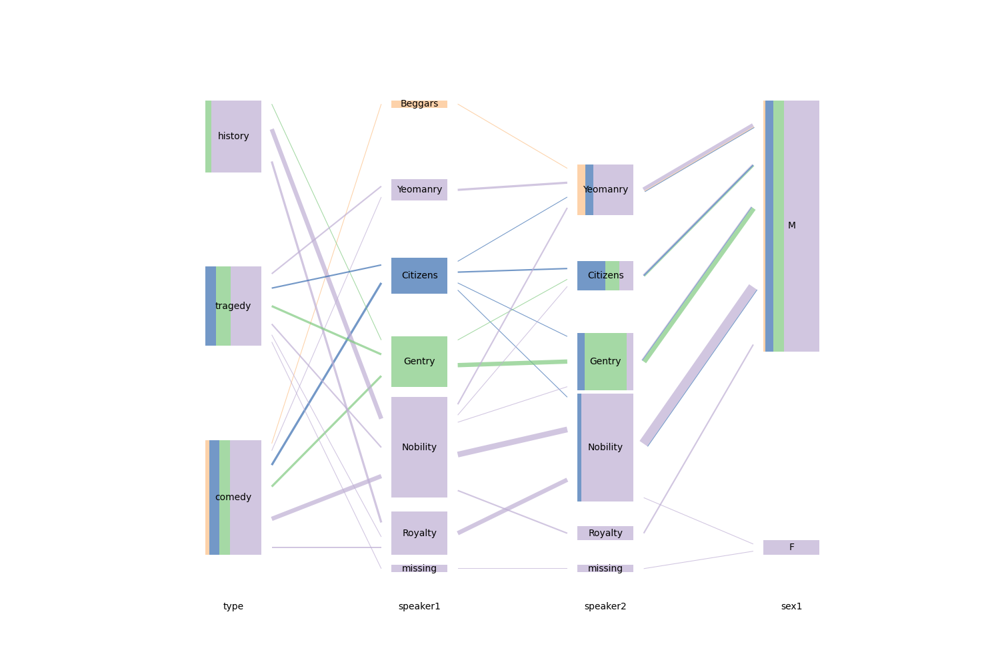

### Example display_type using penguin data

We import the penguin dataset (Horst et al., 2020):

```python
import hammock_plot
import pandas as pd
df = pd.read_csv('./data/data_penguins.csv')
```

We use `display_type` to control how we want to display our data.

#### Numerical display types
Numerical data have three display options: "box", "rug", and "violin".
```python
hammock = hammock_plot.Hammock(df)
ax = hammock.plot(
    var= ["species", "island", "bill_length_mm", "bill_depth_mm", "flipper_length_mm", "body_mass_g"],
    uni_vfill=0.7,
    connector_fraction=0.1,
    hi_var="island",
    hi_value=["Torgersen"],
    missing=True,
    display_type={"bill_length_mm":"box", "bill_depth_mm": "rug", "flipper_length_mm": "violin", "body_mass_g":"box"},
)
```
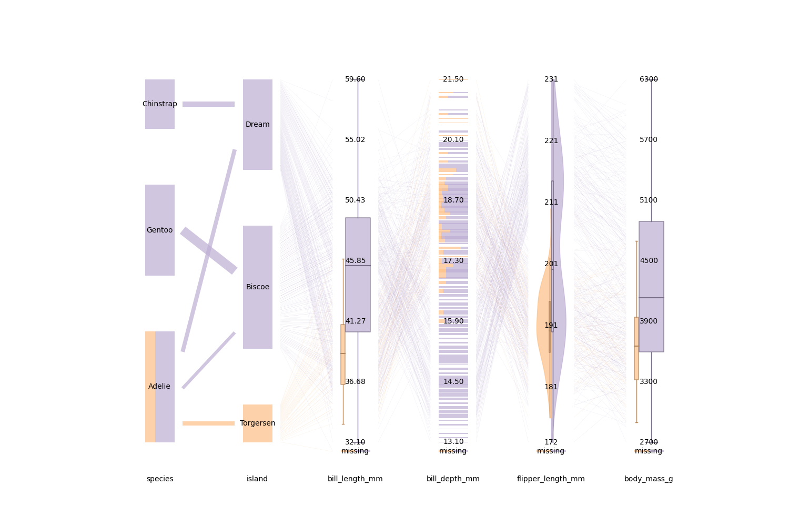

There is some overlap among the boxes in the lumpy rugplot. This could be reduced by setting `uni_vfill' lower (this would also affect the categorical variables). Box plots support multiple highlighted values. Violin plots only support one highlighted value (highlighted value vs remainder).
```python
ax = hammock.plot(
  var= ["species", "island", "bill_length_mm", "bill_depth_mm", "flipper_length_mm", "body_mass_g"],
  uni_vfill=0.99,
  connector_fraction=0.1,
  hi_var="island",
  hi_value=["Torgersen", "Biscoe"],
  missing=True,
  display_type={"bill_length_mm":"box", "bill_depth_mm": "box", "flipper_length_mm": "box", "body_mass_g":"box"},
)
```
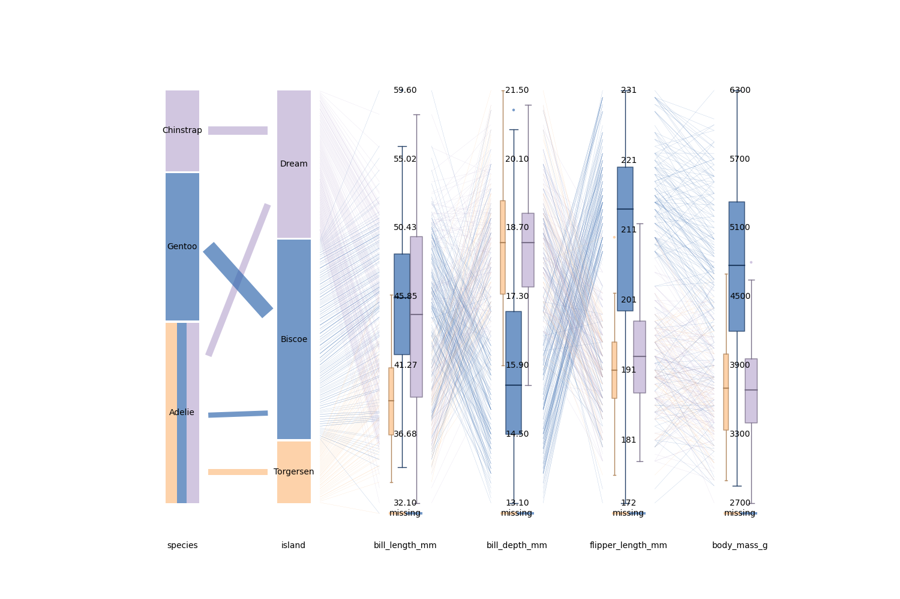

#### Categorical display types
Categorical data has two display options: "stacked_bar", and "bar" (horizontal bar chart). Default is "stacked_bar".

For horizontal bar charts, set uni_vfill to a higher value for better visuals. When uni_vfill is high, lower the connector_fraction.
```python
hammock = hammock_plot.Hammock(df)
ax = hammock.plot(
    var= ["species", "island", "bill_length_mm", "bill_depth_mm", "flipper_length_mm", "body_mass_g"],
    uni_vfill=0.7,
    connector_fraction=0.1,
    hi_var="island",
    hi_value=["Torgersen", "Biscoe"],
    missing=True,
    display_type={"species": "bar", "island": "bar", "bill_length_mm":"box", "bill_depth_mm": "box", "flipper_length_mm": "box", "body_mass_g":"box"},
)
```
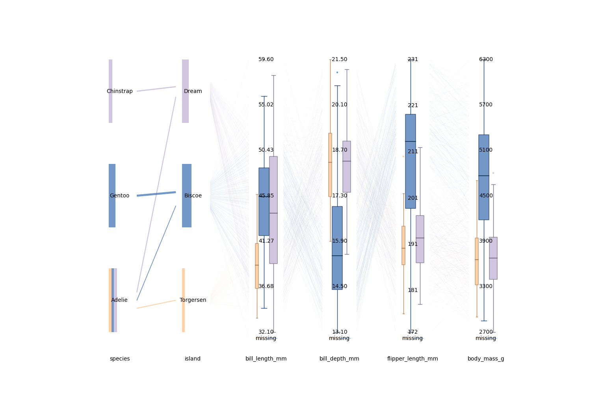

## API Reference

```
  hammock()
```

| Category | Parameter | Type     | Description                |
| --- | :-------- | :------- | :-------------------------  |
| General |     `var` | `List[str]` | List of variables to display. The order determines the variable order in the graph.   |
| |             `value_order` | `Dict[str, List[int]]`  |  If specified, the order of the values in the plot follows the order of values in the list supplied in the dictionary. Only applicable to categorical variables. If a value_order is given to a numerical variable, it will behave like categorical data instead. |
| |            `display_type` | `Dict[str, str]` | Specifies the type of plot. "rug", "box", and "violin" are the options for numerical data, and "stacked_bar", "bar" are the options for categorical data. Example: {"NumericalVarname": "rug", "NumericalVarname2": "violin", "NumericalVarname3": "box"}. Default is "rug" for numerical data and "stacked_bar" for categorical data. |
| |             `missing` | `bool` | Whether or not to add a category for missing values at the bottom of the plot.  If `False`, observations that have a missing value for any variable in the data frame (even those not used in the hammock plot) are removed.  Default is `False`. |
| |             `weights` | `str` | Weight variable (must be a numeric variable with only positive, nonmissing values. Cannot be a member of `var`). |
| Labeling |             `label` | `bool` | Whether or not to display labels between the plotting segments |
| |              `label_options` |  `Dict[str, Dict[str, Any]]`  | Manipulates the size and look of the labels. Args following the options in the website: https://matplotlib.org/stable/api/_as_gen/matplotlib.pyplot.text.html Example:{"ExampleVarname":{"fontsize":12,"fontstyle":"italic","fontweight":"black","color":"b"}}  Default is `None`. |
| |            `numerical_var_levels` | `Dict[str, int \| None]` | Specifies the number of (evenly spaced) labels on the axis for numerical variables. `None`  means that the label management is ignored and instead each numeric value gets a label (beware of overplotting). Example: {"NumericalVarname": 9, "NumericalVarname2": None}. Default is 7. |
| Highlighting and Color  | `hi_var` | `str` |  Variable to be highlighted. Default is `None`. |
| | `hi_value` | `List[str or int] or str or int` | Value(s) of `hi_var` to be highlighted. You can highlighted one or multiple values. You can also pass an expression (e.g. "x>1 and (x>5 or x<4)") in string when you want to specify a range for a numeric `hi_var`.|
| | `hi_box` | `str` | Controls how highlighted values are displayed within category labels. Options are "side-by-side" for side-by-side color segments or "stacked" for horizontally split color segments. Default is "side-by-side".|
| | `hi_missing` | `bool` | Whether or not missing values for `hi_var` should be highlighted. |
| | `colors` | `List[str]` | List of colors corresponding to the list of values to be highlighted. Each color can be specified as a plain color name (e.g., `"red"`, `"yellow"`) or in the format `"color=alpha"` (e.g., `"red=0.5"`) to control transparency/intensity, where `alpha` is a decimal between 0 and 1.|
| | `default_color` | `str` |  Default color of plotting elements for boxes that are not highlighted. |
| | `connector_color` | `str` | The color of the connectors. Default matches the default color + highlight colors. Specifying a connector color removes highlighting from the connectors. | |
| |               `alpha` | `float` | Alpha value for the colours in the plot. Float from 0-1. Default is 0.7. |
| Manipulating Spacing and Layout |             `unibar`| `bool` | Whether or not to display unibars between the plotting segments |
| |   `uni_vfill` | `float`  | Fraction of vertical space that should be populated by data. Adjusts the height of the data points. Default is 0.08.|
| | `connector_fraction` | `float` | Fraction of the `uni_vfill` height used for drawing connectors between unibars. Controls how tall the connectors are relative to the bar height. Default is 1. |
| |              `uni_hfill` |  `float`  |Fraction of horizontal space allocated to labels/univ. bars rather than to connecting boxes. Default is 0.3. |
| |              `height` |  `float`  | Height of the plot in inches. Default is 10. |
| |              `width` |  `float`  |  Width of the plot in inches. Default is 15. Caution: Width too narrow may distort the plot. |
| Other options |              `shape` |  `str`  | Shape of the boxes. "rectangle" or "parallelogram". Default is "rectangle". |
| |              `same_scale` |  `List[str]`  | List of variables that have the same scale. Default is `None`. |
| |              `min_bar_height` | `float` | Minimal bar height of unibars (connectors are unchanged). Bars representing only a tiny fraction of the data may be so narrow, that they are invisible in a plot. The default value tries to ensure this does not happen.  Default is 0.1.
| |              `display_figure` |  `bool`  | Whether or not to display the figure. This can be useful if you just want to save the plots. Default is `True`. |
| |              `save_path` |  `str`  |   If it is not `None`, the figure will be saved to the given path with given name and format. Default is `None`. |
| |             `violin_bw_method` | `str` or `float` | Specifies the bw method used to plot a violin plot. See https://matplotlib.org/stable/api/_as_gen/matplotlib.pyplot.violinplot.html for more details. |


## Historical context

In 1898, Sankey diagrams were developed to visualize flows of energy and materials.

In 1985, Inselberg popularized parallel coordinates to visualize continuous variables only. The central contribution is the use of parallel axes.

In 2003, Schonlau proposed the hammock plot. This was the first plot to visualize categorical data (or mixed categorical and numerical data) on parallel axes.

In 2010, Rosvall proposed alluvial plots to visualize network variables over time. Rather than using bars to connect axes, alluvial plots use rounded curves. Alluvial plots are now also used to visualize categorical data.

There are several additional variations that also visualize categorical data including Parallel Set plots (Bendix et al, 2005), Right Angle plots (Hofmann and Vendettuoli, 2013),
and generalized parallel coordinate plots (GPCPs) (popularized by VanderPlas et al., 2023).

### References
Bendix, F., Kosara, R., & Hauser, H. (2005). Parallel sets: visual analysis of categorical data. In IEEE Symposium on Information Visualization, 2005. INFOVIS 2005. 133-140.

Hofmann, H., & Vendettuoli, M. (2013). Common angle plots as perception-true visualizations of categorical associations. IEEE transactions on visualization and computer graphics, 19(12), 2297-2305.

Horst, A. M., Hill, A. P., & Gorman, K. B. (2020). palmerpenguins: Palmer Archipelago (Antarctica) penguin data} (Version 0.1.0) [R package ]. https://doi.org/10.5281/zenodo.3960218

Inselberg, A., & Dimsdale, B. (2009). Parallel coordinates. Human-Machine Interactive Systems, 199-233.

Rosvall, Martin, & Bergstrom, C.T. (2010) "Mapping change in large networks." PloS one 5.1: e8694.

Sankey, H. (1898). Introductory note on the thermal efficiency of steam-engines. report of
the committee appointed on the 31st march, 1896, to consider and report to the council
upon the subject of the definition of a standard or standards of thermal efficiency for
steam-engines: With an introductory note. In Minutes of proceedings of the institution
of civil engineers, Volume 134,  278–283.

Schonlau M. Hammock plots: visualizing categorical and numerical variables. Journal of Computational and Graphical Statistics, November 2024. 33(4), 1475-1487.

Schonlau M.
*[Visualizing Categorical Data Arising in the Health Sciences Using Hammock Plots.](http://www.schonlau.net/publication/03jsm_hammockplot.pdf)*
In Proceedings of the Section on Statistical Graphics, American Statistical Association; 2003

VanderPlas, S., Ge, Y., Unwin, A., & Hofmann, H. (2023).
Penguins Go Parallel: a grammar of graphics framework for generalized parallel coordinate plots.
Journal of Computational and Graphical Statistics,  32(4), 1572-1587.

### Other implementations of the hammock plot
There is also a Stata implementation `hammock` (available from the Stata archive SSC) and an R implementation (without numerical variables) as part of the package `ggparallel`.

[](https://choosealicense.com/licenses/mit/)


## Authors

- Tiancheng Yang t77yang@uwaterloo.ca
- Sandra Huang sandra.huang@uwaterloo.ca
- Matthias Schonlau schonlau@uwaterloo.ca
