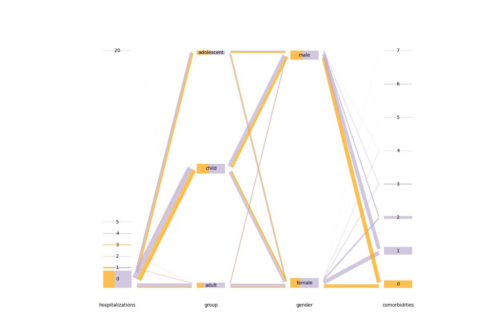

# Summary

Categorical data plays a pivotal role and has been widely used in a variety of domains, including finance, business analysis, and artificial intelligence. The analysis and interpretation of categorical data are crucial for inspiring meaningful insights. Visualization is important in this process since effective visualization techniques can greatly enhance exploratory data analysis and data pre-processing by making complex relationships more understandable. The Hammock plot is such an innovative tool that represents the clear relationships between different labels, including missing values and continuous data. 

The Hammock plot is a graphical tool designed to visualize categorical or mixed categorical/continuous data. In this visualization, variables are arranged parallel to the vertical axis, with categories within each variable distributed along a vertical line. The connections between categories of adjacent variables are represented by either rectangles or parallelograms (and for simplicity just called it box). The width of each box is proportional to the number of observations, and this width is measured by the distance between the longer set of parallel lines rather than the vertical distance.

When the boxes collapse into a single line, and no labels or missing values are present, the Hammock plot will be transformed into a parallel coordinate plot. Boxes become single lines if the barwidth is sufficiently small. For continuous variables, boxes typically appear as single lines because each category usually contains only one observation.

The sequence of variables in the varlist decides their order in the graph. All variables in the varlist have to be numerical so that string variables should first be converted to numerical format using methods such as encode or destring.

An illustrative example can be found in \autoref{fig:highlight_asthma}. The asthma dataset includes essential patient information with both numeric and categorical data types. In this figure, we present a Hammock plot with four variables, highlighting the data for the variable "comorbidities" with a value of 0. This highlighting feature tracks the relationships between specific values of certain variables and all other variables. The thickness of each rectangle indicates the relative number of observations for each value pair which provides a clear visual representation of the data distribution and relationships.

<figure>
  
  <figcaption>An illustrative example of a Hammock plot highlighting asthma data with the variable "comorbidities" set to 0. </figcaption>
</figure>

The Python implementation of the Hammock plot involves two primary stages: data processing and figure plotting. The data processing stage employs pandas [@pandas] and numpy [@numpy] libraries, while the figure plotting stage utilizes matplotlib library [@matplotlib]. In the data processing stage, multiple assertion checks are implemented to ensure the validity of the input data. Following this, the necessary data attributes such as the width of each parallelogram/rectangle and their corresponding colors are computed based on the inputs provided. This processed data is then passed to the plotting functions which performs further calculations to determine the coordinates of each component. During the plotting stage, trigonometric calculations are used to compute the width and height of different types of figures. Finally, the plot is rendered using matplotlib, generating the final Hammock plot.

# Statement of need

The Hammock plot was first introduced in 2003 to handle mixed categorical and numerical data in survey research [@Schonlau2003]. Despite the appearance of various plotting techniques over the past 20 years such as generalized parallel coordinate plots and alluvial plots, the Hammock plot has its own distinct advantages [@Schonlau2024]. Initially, the Hammock plot software was released in a Stata version [ref]. However, with the development of Python in the field of data science, there is a growing need to implement this useful tool in the Python language. The Python package for the Hammock plot can be easily installed and integrated with existing Python projects through its APIs.

# Citations

Citations to entries in paper.bib should be in
[rMarkdown](http://rmarkdown.rstudio.com/authoring_bibliographies_and_citations.html)
format.

If you want to cite a software repository URL (e.g. something on GitHub without a preferred
citation) then you can do it with the example BibTeX entry below for @fidgit.

For a quick reference, the following citation commands can be used:
- `@author:2001`  ->  "Author et al. (2001)"
- `[@author:2001]` -> "(Author et al., 2001)"
- `[@author1:2001; @author2:2001]` -> "(Author1 et al., 2001; Author2 et al., 2002)"

# Figures

Figures can be included like this:

and referenced from text using \autoref{fig:example}.

Figure sizes can be customized by adding an optional second parameter:
{ width=20% }

# Acknowledgements

We acknowledge contributions from Brigitta Sipocz, Syrtis Major, and Semyeong
Oh, and support from Kathryn Johnston during the genesis of this project.

# References
