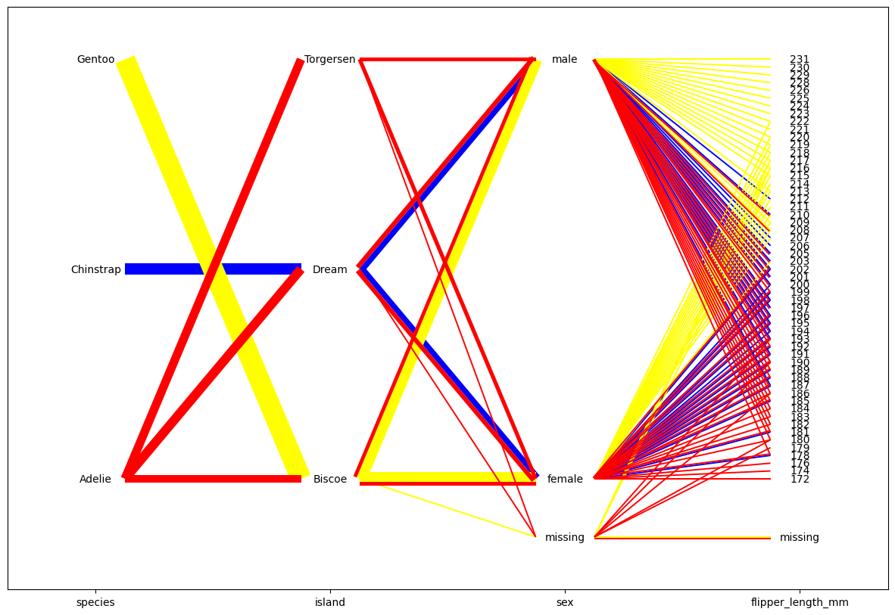
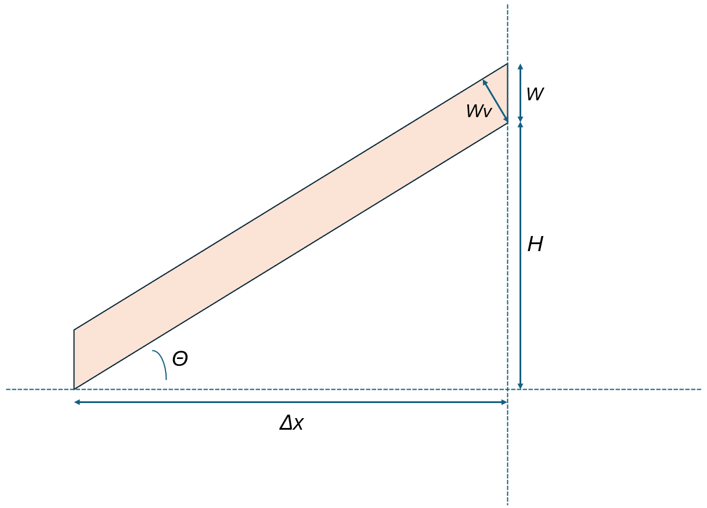

# Summary

Effective visualization techniques can greatly enhance exploratory data analysis and data pre-processing by making complex relationships more understandable. Most data sets contain both categorical and numerical variables. The Hammock plot [@Schonlau2003] was the first plot to visualize a mixture of categorical and numerical variables in a single plot. A number of related plots have been developed since then, including alluvial plots [@alluvial], Common angle plots [@hofmann2013common] and Generalized parallel coordinate plots [@doi:10.1080/10618600.2023.2195462; @DBLP:journals/corr/abs-2009-12933]. @Schonlau2024 gives an overview over such plots.

For continuous data, the parallel coordinate plots [@inselberg1985plane; @Wegman] uses parallel axes to visualize multiple variables. The hammock plot also uses this parallel axis but the connections between categories of adjacent variables are represented by either rectangles or parallelograms (for simplicity often called boxes). The width of each box is proportional to the number of observations.  Often, categories and values are labeled and, optionally, one category at the bottom of the plot is reserved for missing values. 

\autoref{fig:fig1} shows a Hammock plot for the Palmer Penguins dataset [@RJ-2022-020]. This data set contains both numeric (flipper length) and categorical (species, island, sex) data types. The Hammock plot highlights the values of the variable “species” with three colors, so that we can trace different penguin species throughout the graph.  The graph shows, for example, Adelie is the only species present on the island Torgensen. The species Adelie is present on all islands in roughly equal numbers. The species Adelie tends to have a smaller flipper length than other species. Flipper length and sex have a few missing values.  

Hammock plots offer several customizations that enhance visualization. As shown in \autoref{fig:fig1}, one key feature is the ability to highlight specific categories with user-selected or pre-defined colors, making it easy to trace specific categories through the entire plot. Optionally, hammock plots can also show missing values by reserving a space at the bottom of the plot (\autoref{fig:fig1}).  Additionally, users can customize the order of variables and the order of categories within each variable.  When two or more variables have the same categories, a given category appears in the same position on each parallel axis.  This is true even if some categories are missing for a subset of such variables (use “same_scale” option). 

The Python implementation of the Hammock plot consists of two primary stages: data processing and figure plotting. The data processing stage employs pandas [@pandas] and numpy [@numpy] libraries, while the figure plotting stage utilizes the matplotlib library [@matplotlib]. In the data processing stage, multiple assertion checks are implemented to ensure the validity of the input data. Next, necessary data attributes such as the width of each parallelogram/rectangle and their corresponding colors are computed based on the inputs provided. These processed data are then passed to the plotting functions which performs further calculations to determine the coordinates of each component. During the plotting stage, width and height of all boxes are computed (see “Hammock Plot Formulas” below). Finally, the plot is rendered using matplotlib, generating the final Hammock plot.

# Statement of need

The Hammock plot was first introduced in 2003 to handle mixed categorical and numerical data [@Schonlau2003]. The Hammock plot was released as a Stata package. However, with the development of Python in the field of data science, there is a growing need to implement this useful tool in the Python language. The Python packag e for the Hammock plot can be easily installed and integrated with existing Python projects through its APIs.

# Hammock Plot Formulas

The Hammock plot uses several key formulas to calculate the dimensions and positions of the parallelograms (or rectangle) representing the relationships between categories as shown in \autoref{fig:fig2}. Below are the primary formulas used in the implementation:

#### 1. Width of Parallelograms

The width of each parallelogram is proportional to the number of observations that take both category \( i \) of the first variable and category \( j \) of the adjacent second variable.  The width \( W \) is calculated as follows:

\[ W = \frac{n_{ij}}{N} \]

where:
- \( n_{ij} \) is the number of observations for the value pair \( (i, j) \).
- \( N \) is the total number of observations.

#### 2. Height of Parallelograms

The height \( H \) of each parallelogram is determined based on the spacing between the categories along the vertical axis. For example, if the vertical axis ranges from 0 to 100, a variable with three categories might be plotted at 0, 50, and 100. If a parallelogram goes from the bottom of the previous variable to the middle category of this variable, then \( H \) = 50.

#### 3. Angle for Parallelograms

The angle \( \theta \) of the parallelogram can be calculated using arctan functions based on the horizontal and vertical distances between the categories:

\[ \theta = \arctan\left(\frac{H}{\Delta x}\right) \]

where:
- \( H\) is the height of each parallelogra.
- \( \Delta x \) is the horizontal distance between the categories.

#### 4. Vertical Width of Parallelograms

The vertical width \( W_v \) of a parallelogram, which represents the side length of the parallelogram, can be calculated using the width \( W \) and the angle \( \alpha \):

\[ W_v = \frac{W}{\cos(\theta)} \]

where:
- \( W \) is the width of the parallelogram.
- \( \theta \) is the angle between the angle for parallelograms calculated above.

Additional formulas are given in the online Appendix in [@Schonlau2024].

# References
